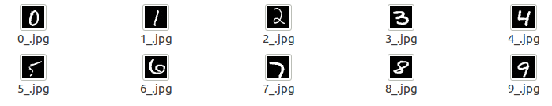

# simple-tensorrt-deploy
## LeNet Network PyTorch=>ONNX=>TensorRT
This is a simple tensorrt example for mnist data

## 1.Reference
- **LeNet:** [Gradient-Based Learning Applied to Document Recognition](http://yann.lecun.com/exdb/publis/pdf/lecun-01a.pdf)
- From [tensorrt_inference] (https://github.com/linghu8812/tensorrt_inference), and I fix some bug in it.

## environment
This is my environment, you can change your environment in deploy/CMakeLists.txt,
but TensorRT version must be corresponding with cuda version
- pytorch1.4~1.7
- TensorRT-7.0.0 (you can change in CMakeLists.txt)
- cuda10.2       (you can change in CMakeLists.txt)
- OpenCV3.4.9    (you can change in CMakeLists.txt)


## 2.Train PyTorch Network
```
cd tools
python train.py
```

## 3.Export ONNX Model
```
cd tools
python export_onnx.py
```

## 4.Build lenet_trt Project
```
cd deploy
mkdir build && cd build
cmake ..
make -j
```

## 5.Run lenet_trt
```
./lenet_trt ../../config.yaml ../../samples
```

## 6.Benchmark(2080Ti)
model|PyTorch|TensorRT|
---|---|---
inference time|0.4ms|0.046ms

## 7. Infer Result

